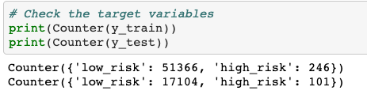
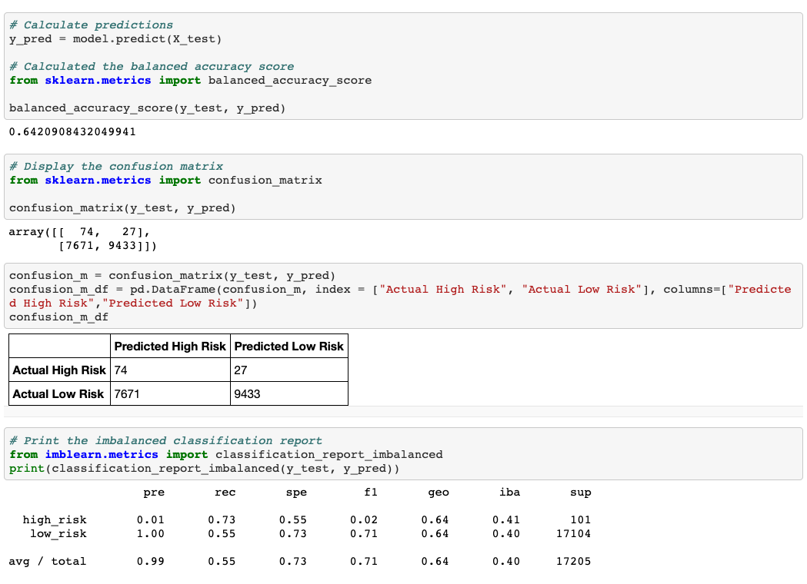
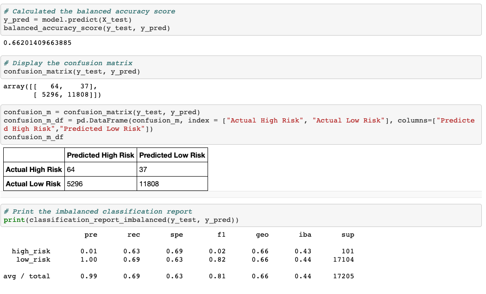
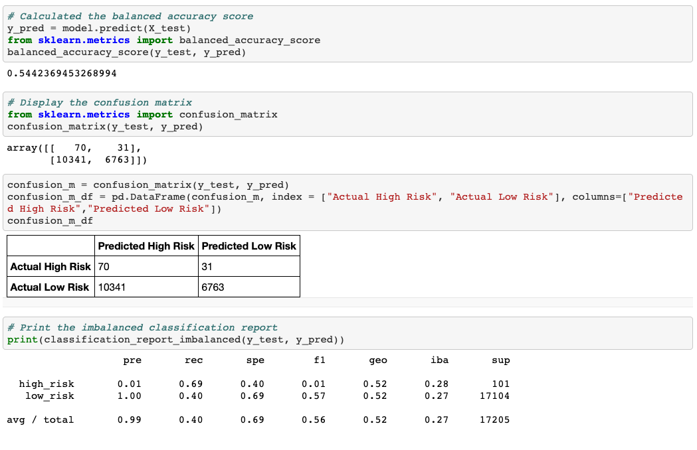
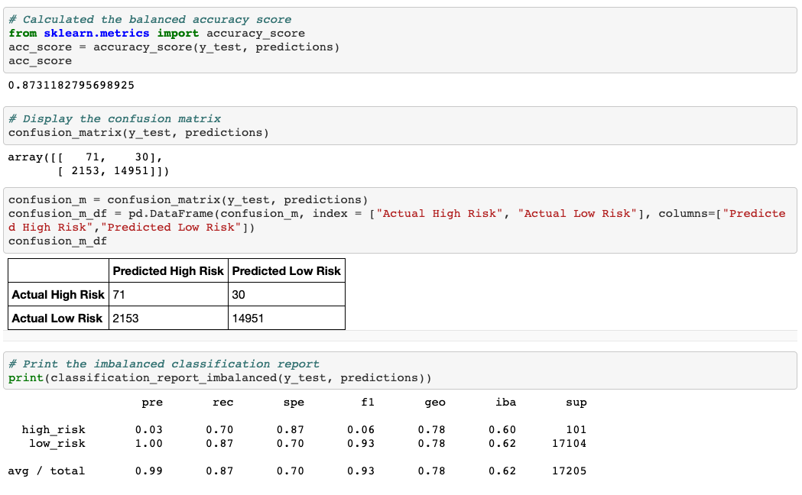
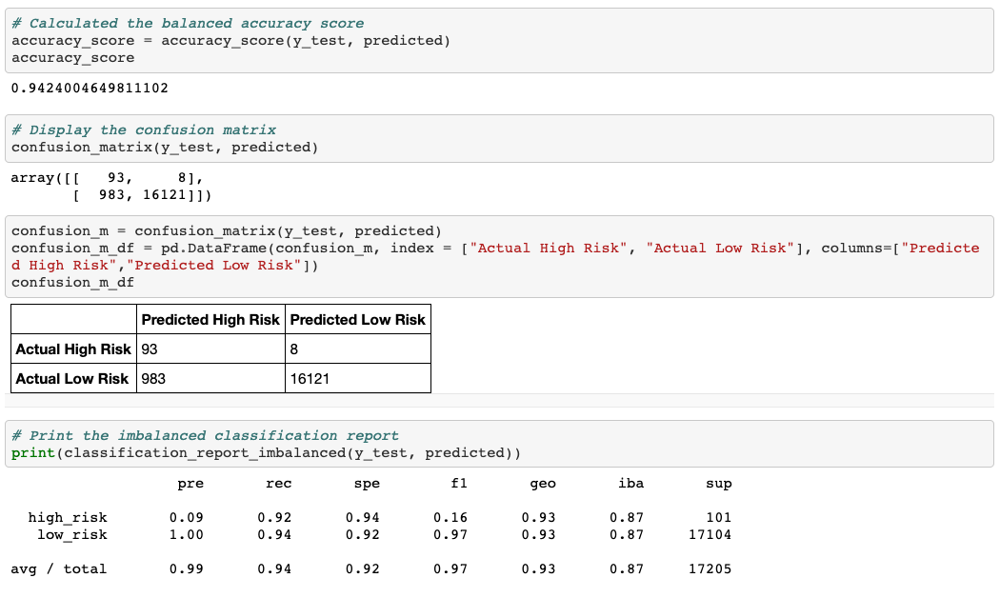

# Credit Risk Analysis

## Overview

In this project, we utilized supervised machine learning statistical algorithms to build and evaluate models. We intended to predict credit risk by using the credit card dataset from LendingClub, a peer-to-peer lending services company. The classes for high-risk users and low-risk users were unbalanced so we needed to employ different techniques to resample the data.
The following tasks were done in this project:

- Use RandomOverSampler and SMOTE algorithms to oversample the data.
- Use the ClusterCentroids algorithm to undersample the data.
- Use a combinatorial approach of over- and undersampling using the SMOTEENN algorithm.
- Compare two new machine learning models that reduce bias, BalancedRandomForestClassifier and EasyEnsembleClassifier.

## Resources

- Data Source: LoanStats_2019Q1.csv
- Software: Python 3.8.5, Anaconda 4.10.1

## Results

After splitting the target data into training and testing, our target contained 68,817 data, the low-risk class had 68,470 and the high-risk class contained 347.
The information of training and testing data was as follows:

### Oversampling

#### Random Oversampling

- The balanced accuracy score was 0.64.
- The precision for predicting high risk was 0.01. It meant that if 100 credit cards were predicted as high-risk, 1 of 100 actually had high risk.
- The sensitivity for predicting high risk was 0.73. If 100 credit cards actually had high risk, 73 of 100 were correctly diagnosed.
- The F1 score for predicting high risk was 0.02. It was pretty low which indicated that there was a pronounced imbalance between sensitivity and precision.

The results for Random Oversampling:

#### SMOTE Oversampling

- The balanced accuracy score was 0.66.
- The precision for predicting high risk was 0.01. It meant that if 100 credit cards were predicted as high-risk, 1 of 100 actually had high risk.
- The sensitivity for predicting high risk was 0.63. If 100 credit cards actually had high risk, 63 of 100 were correctly diagnosed.

- The F1 score for predicting high risk was 0.02. It was pretty low which indicated that there was a pronounced imbalance between sensitivity and precision.

The results for SMOTE Oversampling:

### Undersampling

- The balanced accuracy score was 0.54.
- The precision for predicting high risk was 0.01. It meant that if 100 credit cards were predicted as high-risk, 1 of 100 actually had high risk.
- The sensitivity for predicting high risk was 0.69. If 100 credit cards actually had high risk, 69 of 100 were correctly diagnosed.
- The F1 score for predicting high risk was 0.01. It was pretty low which indicated that there was a pronounced imbalance between sensitivity and precision.

The results for Undersampling:

### Combination (Over and Under) Sampling

- The balanced accuracy score was 0.65.
- The precision for predicting high risk was 0.01. It meant that if 100 credit cards were predicted as high-risk, 1 of 100 actually had high risk.
- The sensitivity for predicting high risk was 0.72. If 100 credit cards actually had high risk, 72 of 100 were correctly diagnosed.
- The F1 score for predicting high risk was 0.02. It was pretty low which indicated that there was a pronounced imbalance between sensitivity and precision.

The results for Combination (Over and Under) Sampling:

### Ensemble Learners

#### Balanced Random Forest Classifier

- The balanced accuracy score was 0.87.
- The precision for predicting high risk was 0.03. It meant that if 100 credit cards were predicted as high-risk, 3 of 100 actually had high risk.
- The sensitivity for predicting high risk was 0.70. If 100 credit cards actually had high risk, 70 of 100 were correctly diagnosed.
- The F1 score for predicting high risk was 0.06. It was pretty low which indicated that there was a pronounced imbalance between sensitivity and precision.

The results for Balanced Random Forest Classifier:

#### Easy Ensemble Classifier

- The balanced accuracy score was 0.94.
- The precision for predicting high risk was 0.09. It meant that if 100 credit cards were predicted as high-risk, 9 of 100 actually had high risk.
- The sensitivity for predicting high risk was 0.92. If 100 credit cards actually had high risk, 92 of 100 were correctly diagnosed.
- The F1 score for predicting high risk was 0.16. It was pretty low which indicated that there was a pronounced imbalance between sensitivity and precision.

The results for Easy Ensemble AdaBoost Classifier:

## Summary

To summarize the results of the 6 models, the EasyEnsembleClassifier model had the best result with an accuracy score of 0.94 and a 9% precision rate. However, all six models were not recommended in the real world as all of them had a pronounced imbalance between sensitivity and precision.

The unbalanced classification problem was natural in credit risk as good loans could easily outnumber risky loans. In order to combat the unbalance, we would suggest trying different algorithms. In this project, we used logistic regression to process the analysis. However, decision trees might be a good choice. Future analysis could focus on using different algorithms such as decision trees.
